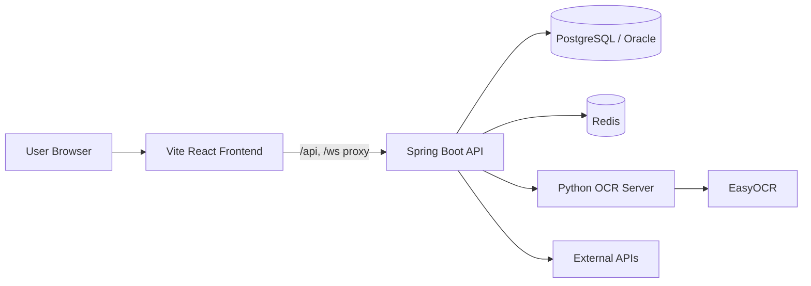

<div align="center">
  

  <h1>DevPath</h1>
  <p><strong>개발자의 학습, 프로젝트, 커리어 성장을 하나로 잇는 성장 플랫폼</strong></p>

  <p>
    <a href="https://devpath.kr"><strong>서비스 바로가기</strong></a>
    ·
    <a href="#서비스-한눈에-보기">서비스 소개</a>
    ·
    <a href="#자세히-보기">자세히 보기</a>
    ·
    <a href="#팀원">팀원</a>
  </p>

  <p>
    
    
    
    
    
    
    
  </p>
</div>

---

## 서비스 한눈에 보기

DevPath는 개발자의 성장 과정을 학습, 실습, 협업, 커리어까지 연결하는 웹 플랫폼입니다.
학습자는 맞춤 로드맵과 강의로 방향을 잡고, 팀 워크스페이스와 멘토링으로 프로젝트 경험을 쌓으며, 커리어 기능으로 결과물을 정리할 수 있습니다.

| 구분 | 내용 |
| --- | --- |
| 서비스 URL | [https://devpath.kr](https://devpath.kr) |
| 주요 사용자 | 학습자, 강사, 관리자 |
| 핵심 흐름 | 로드맵 추천 → 강의 학습 → 프로젝트 협업 → 포트폴리오와 채용 분석 |
| 레포 구성 | Spring Boot 백엔드, Vite React 프론트엔드, Python OCR 서버, Docker Compose 인프라 |

## 주요 카테고리

| 아이콘 | 카테고리 | 핵심 기능 |
| --- | --- | --- |
| 🧭 | 학습 로드맵 | 맞춤 로드맵, 강의 탐색, 학습 플레이어, 퀴즈와 과제 |
| 🧑‍🏫 | 강사 운영 | 강의 관리, 콘텐츠 편집, 수강생 분석, Q&A, 수익 관리 |
| 🧩 | 팀 프로젝트 | 워크스페이스, 칸반, 일정, 파일, 회의, ERD, 코드 리뷰 |
| 💼 | 커리어 | 채용 분석, 이력서, 포트폴리오, Proof Card, 쇼케이스 |
| 💬 | 커뮤니티 | 라운지, 게시글, 댓글, 좋아요, 멘토링 허브 |
| 🛡️ | 관리자 | 계정 관리, 로드맵 거버넌스, 강의 검수, 신고 처리 |
| 🤖 | AI/OCR | AI 코드 리뷰, AI 디자인 리뷰, 영상 학습 OCR, EasyOCR 연동 |

## 자세히 보기

<details>
<summary><strong>🧭 서비스 핵심 기능 자세히 보기</strong></summary>

### 학습자

- 맞춤 로드맵과 로드맵 허브를 통해 학습 방향을 탐색합니다.
- 강의 목록과 학습 플레이어로 콘텐츠를 수강합니다.
- 퀴즈, 과제, 학습 로그를 통해 학습 결과를 관리합니다.

### 강사

- 강의와 콘텐츠를 등록하고 관리합니다.
- 과제와 퀴즈를 편집하고 수강생 학습 데이터를 확인합니다.
- 멘토링, Q&A, 리뷰, 수익 관리 화면을 제공합니다.

### 프로젝트와 협업

- 팀 워크스페이스에서 칸반, 일정, 파일, 회의, ERD를 관리합니다.
- 스쿼드 워크스페이스와 멘토링 워크스페이스를 제공합니다.
- 코드 리뷰와 실시간 협업 흐름을 지원합니다.

### 커리어와 커뮤니티

- 채용 분석, 이력서, 포트폴리오, Proof Card 기능을 제공합니다.
- 커뮤니티 라운지, 게시글, 댓글, 좋아요, 쇼케이스를 제공합니다.

### 관리자

- 관리자 대시보드에서 계정, 기술 태그, 공식 로드맵, 노드 추천 자료, 강의 메뉴, 강의 검수와 신고를 운영합니다.
- 통합 운영 센터에서 채용·기업, 학습 자동화, 추천·분석, A/B 실험, 플랫폼 공지, 환불·정산과 외부 의존성 상태를 운영하며 일반 사용자는 공개된 플랫폼 공지를 조회할 수 있습니다.
- 제한 관리자 Role은 대시보드, 계정, 거버넌스, 검수, 채용, 학습, 공지, 정산 권한을 조합해 배정하며 각 권한은 실제 관리자 API 인가에 적용됩니다.
- 강의 HLS URL은 수강생, 공개 강의의 미리보기 차시, 강사 소유자와 거버넌스 권한 관리자에게만 발급하고 시스템 정책의 최대 동시 학습 기기 수를 브라우저 기기 식별자 기준으로 적용합니다.
- A/B 실험은 생성, 시작, 일시 중지, 재개, 결과 저장과 완료 상태를 관리합니다. 외부 이벤트 수집 인프라는 포함하지 않으므로 검증된 지표 JSON을 관리자가 저장합니다.

</details>

<details>
<summary><strong>🏗️ 아키텍처 자세히 보기</strong></summary>



| 구성 | 역할 |
| --- | --- |
| Vite React Frontend | 사용자 화면, 라우팅, API 프록시 |
| Spring Boot API | 인증, 도메인 API, 관리자 기능, 실시간 기능 |
| PostgreSQL / Oracle | 로컬 PostgreSQL과 운영 프로필 기반 관계형 데이터 저장 |
| Redis | 캐시와 세션성 데이터 처리 |
| Python OCR Server | 학습 영상과 이미지 기반 OCR 처리 |
| External APIs | OAuth, AI, 채용 정보 등 외부 연동 |

</details>

<details>
<summary><strong>🛠️ 기술 스택 자세히 보기</strong></summary>

| 구분 | 기술 |
| --- | --- |
| Backend | Java 21, Spring Boot 4, Spring Web MVC, Spring Security, OAuth2 Client, JWT, JPA |
| Frontend | React 19, TypeScript 6.0, Vite 8, Tailwind CSS 4, Axios, Chart.js |
| Database | PostgreSQL 15 로컬 환경, Oracle 운영 프로필, Redis 7 |
| AI/OCR | Gemini API 연동, Flask, EasyOCR, OpenCV, Tesseract.js |
| Docs | Springdoc OpenAPI, Swagger UI |
| Infra | Docker, Docker Compose, Nginx |
| Quality | JUnit Platform, H2 테스트 런타임, Spotless, ESLint, Vitest, React Testing Library, Playwright |

</details>

<details>
<summary><strong>🚀 로컬 실행 자세히 보기</strong></summary>

### 사전 준비

- JDK 21
- Node.js 22 이상, Node.js 24 권장
- FFmpeg 9 이상 권장. 강의 영상 업로드 시 HLS 변환과 AES-128 암호화에 사용하며, 없어도 원본 영상 폴백으로 업로드는 계속됩니다.
- Docker Desktop 또는 Docker Compose
- PostgreSQL과 Redis를 직접 띄우거나 Docker Compose 사용

### 환경 변수

실제 `.env` 값은 공개 저장소에 올리면 안 됩니다.
README에는 필요한 키를 알려주는 예시만 둡니다.
팀에서 공유하는 실제 값은 비공개 채널, 시크릿 관리 도구, 배포 환경 변수로 관리합니다.

```properties
SERVER_PORT=8083

DB_HOST=localhost
DB_PORT=5432
DB_NAME=<database-name>
DB_USER=<database-user>
DB_PASSWORD=<database-password>

REDIS_HOST=localhost
REDIS_PORT=6379
REDIS_PASSWORD=<redis-password>

JWT_SECRET=<base64-hmac-secret>

GITHUB_CLIENT_ID=<github-oauth-client-id>
GITHUB_CLIENT_SECRET=<github-oauth-client-secret>
GOOGLE_CLIENT_ID=<google-oauth-client-id>
GOOGLE_CLIENT_SECRET=<google-oauth-client-secret>

DEVPATH_OAUTH2_REDIRECT_URL=http://localhost:8084/oauth2/redirect
DEVPATH_OAUTH2_ALLOWED_ORIGINS=http://localhost:8084
DEVPATH_CORS_ALLOWED_ORIGINS=http://localhost:8084
DEVPATH_REQUIRE_HTTPS=false

OCR_SERVER_URL=http://localhost:5000
GEMINI_API_KEY=<gemini-api-key>

# PATH에서 ffmpeg를 찾을 수 없을 때 실행 파일의 절대 경로를 지정합니다.
FFMPEG_PATH=<ffmpeg-executable-path>
MEDIA_TRANSCODING_TIMEOUT=10m

# HLS 재생 목록·세그먼트·AES 키 만료 URL 서명. 운영에서는 JWT 키와 분리한 임의 값을 사용합니다.
HLS_URL_SIGNING_SECRET=<hls-url-signing-secret>
HLS_URL_TTL=10m

# 잡코리아 설정이 없으면 수집 API는 성공으로 위장하지 않고 명시적으로 실패합니다.
JOBKOREA_JOB_LIST_URL=<jobkorea-job-list-xml-url>
JOBKOREA_STARTER_LIST_URL=<jobkorea-starter-list-xml-url>
JOBKOREA_API_KEY=<jobkorea-api-key>
```

위 예시는 기본 로컬 프로필의 PostgreSQL 설정입니다. 운영 프로필은 `DB_URL`을 사용하고 `DB_DRIVER`를 지정하지 않으면 Oracle JDBC 드라이버를 기본값으로 사용합니다.

### 인프라 실행

```bash
docker compose up -d postgres redis ocr-server
```

### 백엔드 실행

```bash
./gradlew bootRun
```

Windows PowerShell에서는 아래 명령을 사용할 수 있습니다.

```powershell
.\gradlew.bat bootRun
```

### 로컬 데이터 초기화

기본 `local` 프로필에서는 PostgreSQL 스키마와 졸업작품 데모 데이터를 다음 순서로 준비합니다.

1. Spring SQL 초기화가 `db/local/project-schema-prep.sql`을 실행해 Hibernate 시작 전에 프로젝트 관련 보조 스키마와 조건부 데이터를 준비합니다.
2. 애플리케이션 시작 후 Java 초기화기가 사용자, 강의, 로드맵 등의 기준 데이터를 확인합니다. 기준 데이터가 없으면 `db/legacy/seed-data.sql`을 복원하고, 빈 DB에서도 완성된 데모 상태가 되도록 프로젝트 시드를 다시 적용합니다.
3. 나머지 초기화기가 테스트 계정과 권한, 비밀번호, 프론트엔드 초안 강의, 라운지, 멘토링 허브, 프로젝트 경험, 워크스페이스 허브와 스쿼드 데이터를 기능별 `db/local` SQL로 보정합니다.
4. `db/local/learner-workspace`의 SQL은 학습자 워크스페이스, 멘토링, ERD, 코드 리뷰 데모 데이터를 정규화합니다.

정적인 시드 행과 조회문은 SQL 리소스에 두고, Java 초기화기는 실행 순서와 조건 검사, 트랜잭션, BCrypt 비밀번호 생성, 엔티티 기반 복원을 담당합니다. `LocalSeedSqlExecutor`는 이 SQL들을 UTF-8로 읽어 실행합니다.

기능별 Java 초기화기는 `local`, `dev` 프로필에서만 동작합니다. Hibernate 시작 전 `project-schema-prep.sql` 실행은 기본 `local` 설정에 포함됩니다. 각 SQL 묶음은 실행 시점과 복원 조건이 다르고 서버 재시작 시 필요한 데이터를 안전하게 보정하도록 작성되어 있으므로 임의로 합치거나 삭제하지 않습니다.

### 프론트엔드 실행

```bash
cd frontend
npm ci
npm run dev
```

### Docker Compose 개발 환경 실행

```bash
docker compose up -d --build
```

이 명령은 Vite 개발 서버, PostgreSQL, Redis와 OCR 서버를 실행합니다. Spring Boot 백엔드는 위의 백엔드 실행 명령으로 별도 실행합니다.

정적 Nginx 프론트엔드 이미지를 확인하려면 `frontend-static` 프로필을 사용합니다.

```bash
docker compose --profile frontend-static up -d --build frontend
```

</details>

<details>
<summary><strong>🔗 로컬 URL과 주요 화면 자세히 보기</strong></summary>

### Local URLs

| 서비스 | 주소 |
| --- | --- |
| Frontend | http://localhost:8084 |
| Backend API | http://localhost:8083 |
| Swagger UI | http://localhost:8083/swagger-ui/index.html |
| OCR Server | http://localhost:5000/health |

### Main Pages

| 경로 | 화면 |
| --- | --- |
| `/` 또는 `/home` | 서비스 홈 |
| `/roadmap-hub` | 로드맵 허브 |
| `/lecture-list` | 강의 목록 |
| `/learning` | 학습 플레이어 |
| `/workspace-hub` | 워크스페이스 허브 |
| `/team-ws-dashboard` | 팀 워크스페이스 |
| `/mentoring-hub` | 멘토링 허브 |
| `/job-matching` | 채용 분석 |
| `/community-list` | 커뮤니티 |
| `/admin-dashboard` | 관리자 대시보드 |

### API Docs

백엔드 실행 후 Swagger UI에서 API를 확인할 수 있습니다.

```text
http://localhost:8083/swagger-ui/index.html
```

Vite 개발 서버에서는 프록시가 설정되어 있어 `/api`, `/ws`, `/swagger-ui`, `/v3/api-docs`, `/uploads` 요청이 백엔드로 전달됩니다.

강사가 `lesson-video` 유형으로 영상을 올리고 HLS 정책이 활성화되어 있으면 백엔드는 원본 파일을 보존한 채 6초 세그먼트의 AES-128 HLS 재생 목록을 생성합니다. HLS 재생 목록, TS 세그먼트와 AES 키는 강의 상세 권한 검사 후 발급되는 짧은 만료형 서명 URL로만 제공합니다. 변환 도구가 없거나 변환에 실패하면 원본 영상 URL로 폴백하며 관리자 상태 화면에 `FALLBACK_ONLY`로 표시합니다. 원본 폴백에는 HLS 암호화와 만료형 서명이 적용되지 않으므로 배포 환경에서는 FFmpeg를 준비해야 합니다. Chrome을 포함한 MSE 기반 브라우저에서는 프론트엔드의 `hls.js` 재생 경로를 사용합니다.

Gemini 키가 없거나 호출에 실패하면 지원 기능은 결정론적 폴백만 사용하며 관리자 상태 화면에 이를 명시합니다. 잡코리아 수집 URL이 없으면 수집 API는 가짜 완료 응답을 반환하지 않고 설정 누락 오류를 반환합니다.

</details>

<details>
<summary><strong>📁 프로젝트 구조 자세히 보기</strong></summary>

```text
DevPath
├─ src/main/java/com/devpath
│  ├─ api              # 도메인별 Controller, Service, DTO
│  ├─ domain           # Entity와 Repository
│  ├─ config           # 프로필별 설정과 로컬 초기화 구성
│  └─ DevPathApplication.java
├─ src/main/resources
│  ├─ application*.yaml          # 공통 설정과 프로필별 환경 변수 매핑
│  └─ db
│     ├─ legacy                  # 기본 레거시 시드와 보정 SQL
│     └─ local                   # 로컬 스키마 보정과 기능별 데모 시드 SQL
├─ frontend
│  ├─ src              # React 페이지, 컴포넌트, API 클라이언트
│  ├─ public           # 정적 리소스
│  └─ nginx            # 정적 배포용 Nginx 설정
├─ ocr-server          # Flask + EasyOCR 기반 OCR 서버
├─ docs                # 협업 문서
└─ docker-compose.yml  # 로컬 개발 인프라
```

</details>

<details>
<summary><strong>🧪 개발 명령 자세히 보기</strong></summary>

| 작업 | 명령 |
| --- | --- |
| 백엔드 테스트 | `.\gradlew.bat test` |
| 백엔드 포맷 | `.\gradlew.bat spotlessApply` |
| 백엔드 전체 검증 | `.\gradlew.bat test spotlessCheck --no-daemon` |
| 프론트엔드 개발 서버 | `cd frontend && npm run dev` |
| 프론트엔드 빌드 | `cd frontend && npm run build` |
| 프론트엔드 린트 | `cd frontend && npm run lint` |
| 프론트엔드 단위 테스트 | `cd frontend && npm test` |
| 프론트엔드 E2E 테스트 | `cd frontend && npm run test:e2e` |

</details>

## 팀원

| 이름 | GitHub |
| --- | --- |
| 김용하 | [@yongha03](https://github.com/yongha03) |
| 김태형 | [@ehhyeong](https://github.com/ehhyeong) |
| 박주승 | [@ParkJus](https://github.com/ParkJus) |

## 참고

- 프론트엔드 전용 실행 설명은 [frontend/README.md](frontend/README.md)에 정리되어 있습니다.
- 민감한 키, OAuth Secret, DB 비밀번호, Redis 비밀번호, AI API 키는 README나 커밋 기록에 남기지 않습니다.
